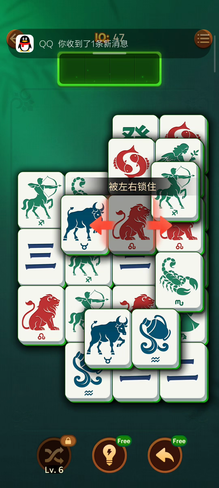
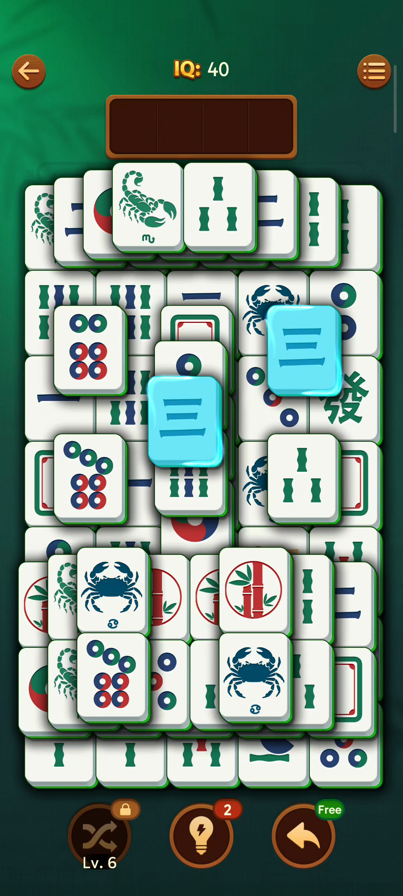
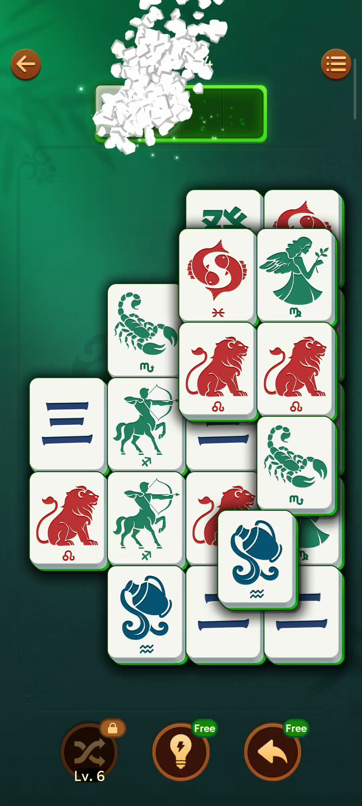
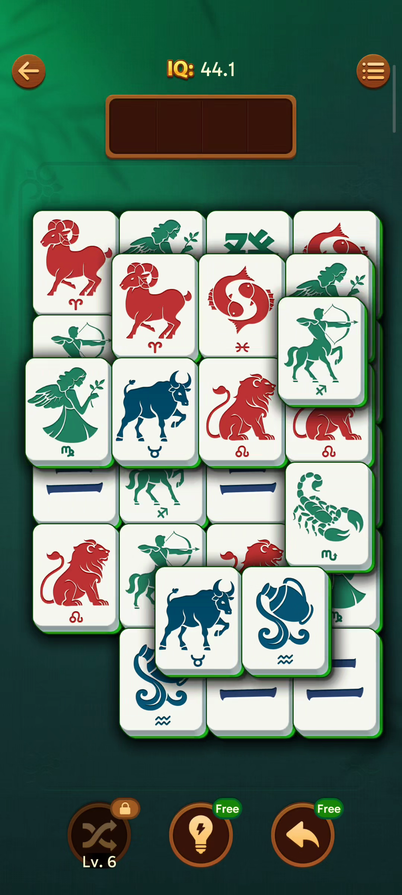
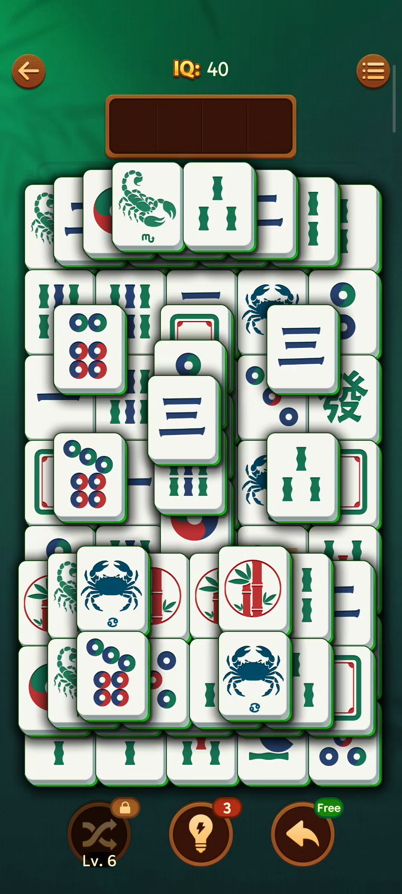
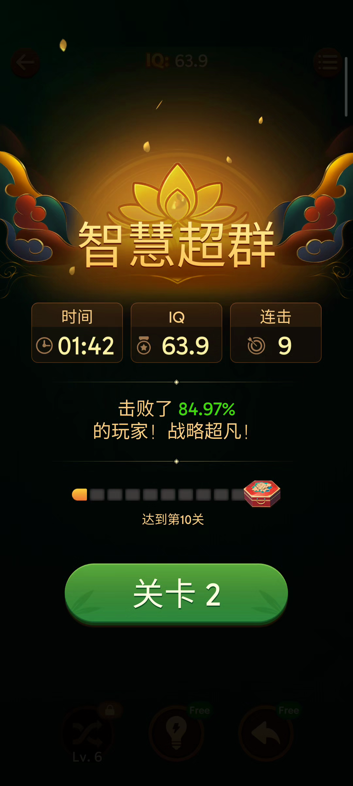

# Vita Mahjong 像素复刻级 PRD

> 版本：v1.0  
> 目标项目：`/Users/mac/Documents/vita-mahjong/`  
> 文档用途：为测试题实现提供完整玩法、界面、数值与关卡设计依据，所有结论均来自真实调研材料，未验证处已明确标注。

---

## 1. 项目概述与目标

### 1.1 产品定位

Vita Mahjong 是经典 Mahjong Solitaire（麻将连连看/麻将消除）的现代移动端版本。面向全年龄段，特别强调老年人、初学者与休闲玩家的友好体验：大牌面、直观触控、清晰视觉、流畅动画，并支持关闭计时/分数压力（来源：官网 Vita Mahjong For Seniors Free / Customizable Scoring）。

### 1.2 本次复刻目标

- 复刻测试题要求的核心流程：**首页（Home）→ 游戏页（Game）→ 结果页（Result）**。
- 支持在手机设备上游玩 **至少 20 关**。
- 还原录屏中的东方古典美术风格、选牌/匹配/消除动效与结算体系。
- 在素材存在矛盾或未确认的地方，如实标注，不做虚构。

### 1.3 核心体验关键词

放松、东方古典、大牌面、即时反馈、连击爽感、轻度策略、银发友好。

---

## 2. 参考来源与调研方法

### 2.1 来源清单

| 来源 | 文件路径 | 用途 |
|------|----------|------|
| 录屏逐帧调研笔记 | `tmp/research_video.md` | 核心玩法流程、动效、UI 坐标、数值观察 |
| 官网文字调研笔记 | `tmp/research_website.md` | 规则定义、道具说明、计分描述、用户群体、平台信息、广告矛盾 |
| 测试题图片分析笔记 | `tmp/research_test_images.md` | 首页/游戏页/结果页 UI 拆解、文字记录、考核重点 |
| 关键节点截图（12 张） | `assets/screenshots/key_nodes/` | 像素级视觉与布局依据 |
| 录屏逐秒帧（70 张） | `assets/screenshots/video_frames/` | 动作时序、过渡动画、交互状态验证 |
| 原始测试题 | `tmp/pdfs/test_page-1.png`、`test_page-2.png` | 需求边界、体验优化空间、提交形式 |

### 2.2 调研方法

1. **录屏逐帧分析**：将 70 秒录屏以每秒 1 帧抽出，记录启动、选牌、匹配、失败复活、结算、关卡切换的时序与数值。
2. **关键节点截图**：从录屏中提取 12 张关键帧，用于 PRD 中直接引用并说明用途。
3. **官网信息抓取**：整理 vitamahjong.io 的规则、FAQ、用户评价，用于补充录屏未覆盖的商业模式与功能描述。
4. **测试题 UI 拆解**：对测试题提供的首页/游戏页/结果页截图进行像素级元素、文字、色彩、布局记录。
5. **交叉验证**：对录屏与测试题之间的不一致（如分数显示 IQ vs. 分数、道具 Free vs. 次数）进行标注，不在 PRD 中做无依据取舍。

---

## 3. 核心玩法规则

### 3.1 胜利目标

将牌面上所有成对且相同的牌全部消除，清空整副牌局即可过关（来源：官网 Rules → Objective / Winning）。

### 3.2 自由牌（Free Tile）判定

- 牌必须**没有被其他牌上下覆盖**。
- 牌的**左侧或右侧至少有一边没有其他牌紧邻遮挡**。
- 同时满足以上两点，才为“自由牌”，可被点击选中（来源：官网 Rules → Matching Tiles；录屏 frame_0010 `被左右锁住` 提示）。



> 图 3-1：被左右锁住的牌无法选取，系统显示红色箭头与“被左右锁住”提示。

### 3.3 匹配消除

1. 点击一张自由牌，该牌向上飞入顶部托盘（slot bar）的最左侧空位。
2. 再点击另一张**图案相同**的自由牌，飞入托盘。
3. 两张牌在托盘中配对成功后，同时从托盘与棋盘移除，触发粒子爆炸、加分、连击计数（来源：录屏 frame_0008 `Good / Combo x5`）。
4. 若点击的牌不是自由牌，则该牌变暗并显示“被左右锁住”提示（来源：录屏）。



> 图 3-2：选中的牌被蓝色高亮，提示玩家可点击另一张相同牌完成匹配。



> 图 3-3：匹配成功后托盘处爆发白色方块粒子，屏幕出现 `Good` 与 `Combo` 反馈。

### 3.4 胜负条件

- **胜利**：棋盘所有牌被清空。
- **失败**：顶部托盘被未配对的牌填满（目测为 5 个 slot），弹出“没有空位了”弹窗，可选择复活或重新开始（来源：录屏 frame_0025 描述）。

> **已确认**：托盘容量为 **4 个 slot**。

---

## 4. 首页（Home）设计

### 4.1 来源说明

录屏中没有展示传统首页，开屏后直接进入第 1 关（来源：`tmp/research_video.md` 第 2.1 节）。因此首页设计主要依据测试题截图与测试题图片分析笔记（来源：`tmp/research_test_images.md` 第 3.1 节）。

### 4.2 整体布局

- **背景**：暖色调中式/和风风格，木质格栅背景，底部有竹席/木质纹理，整体温馨、放松。
- **Logo**：页面中上部展示 `Vita MAHJONG`，`Vita` 为手写/衬线风格，`MAHJONG` 为大写无衬线，Logo 旁有一片绿色叶子装饰。
- **头像/用户区**：左上角显示头像占位 + 金币/积分 `x0`（按测试题截图保留视觉元素，本次复刻不实现金币/经济系统功能）。
- **设置按钮**：右上角齿轮图标。
- **主入口按钮**：页面中下部有一个大型木质/琥珀色胶囊按钮，文字为 `关卡 1`（当前关卡入口）。
- **装饰元素**：Logo 下方有一个圆形铜质门环/窗花装饰，强化东方古典氛围。

> 截图引用依据：测试题 PDF `test_page-1.png` 中首页截图。

### 4.3 入口与导航

| 元素 | 位置/样式 | 交互 |
|------|-----------|------|
| 头像 + 金币 `x0` | 左上角 | 纯视觉展示，无实际功能 |
| 设置齿轮 | 右上角 | 点击进入设置页，可开关音乐、计时/分数压力等 |
| `关卡 1` 主按钮 | 页面中下部，大型木质胶囊按钮 | 点击进入当前最新可玩关卡 |
| Logo / 门环 | 中上部 | 纯视觉装饰，可带轻微呼吸动画 |

### 4.4 视觉风格

- **主色调**：暖棕、琥珀、米色。
- **背景纹理**：木质格栅、竹席。
- **按钮样式**：大型胶囊木质按钮，带高光与阴影，强调可点击感。
- **字体风格**：手写体 Logo + 无衬线中文数字。
- **图标风格**：齿轮、头像、金币均为扁平带描边风格。

> **已确认**：首页按测试题截图实现；本次复刻不加入每日挑战入口、广告/商店入口。

---

## 5. 游戏页（Game）设计

### 5.1 整体布局与视觉风格

- **背景**：深绿色绒布/桌布质感，带暗纹装饰，模拟真实麻将桌。
- **顶部状态栏**：返回按钮、关卡/分数/匹配信息、菜单按钮。
- **选牌托盘**：位于顶部状态栏下方，深棕色底、金色边框，4 个 slot。
- **主棋盘**：占据屏幕中部，牌块呈多层立体堆叠。
- **底部道具栏**：本次复刻不实现道具栏。



> 图 5-1：第 1 关游戏页，牌面主题为十二星座，顶部显示分数（录屏原素材为 IQ，本次复刻使用分数体系）。



> 图 5-2：第 2 关游戏页，牌面主题变为传统麻将，分数重置。

### 5.2 顶部状态栏

#### 5.2.1 录屏中的状态栏（视频来源）

| 元素 | 位置（相对 1080×2400） | 说明 |
|------|------------------------|------|
| 返回按钮 | `(0.07, 0.06)` | 圆形棕色按钮，白色左箭头 |
| 分数 | `(0.50, 0.06)` | 金色“分数”+ 数字，匹配成功时闪金光并浮现 `+x.x` |
| 汉堡菜单 | `(0.93, 0.06)` | 圆形棕色按钮，三条横线 |

> 来源：`tmp/research_video.md` 第 3.1 节。

#### 5.2.2 测试题截图中的状态栏（测试题来源）

| 元素 | 说明 |
|------|------|
| `关卡 1` | 当前关卡编号 |
| `分数 2400` | 当前累计分数 |
| `匹配 3` | 当前连击数（Combo） |

> 来源：`tmp/research_test_images.md` 第 3.2 节。

#### 5.2.3 设计取舍

顶部状态栏采用测试题截图的“关卡 + 分数 + 匹配”三字段布局；`匹配` 字段表示**当前连击数（Combo）**；本次复刻**不展示 IQ**。

### 5.3 牌面结构与层级规则

#### 5.3.1 牌块样式

- 白色牌面、彩色图案、绿色侧边、底部投影、圆角矩形。
- 牌面尺寸：在 1080×2400 基准下，单张牌宽约 0.20–0.22 屏幕宽度，高约 0.10–0.11 屏幕高度（根据录屏第 1 关 4×6 棋盘估算）。
- 层级遮挡：上层牌会覆盖下层牌的顶部边缘，营造立体感。

#### 5.3.2 棋盘布局示例（第 1 关）

第 1 关录屏中可见约 4 列 × 6–8 行，牌面主题为十二星座。根据 `02_game_board.png` 观察，棋盘并非规则矩形，而是传统 Mahjong Solitaire 的多层金字塔/不规则堆叠。

#### 5.3.3 层级规则

- 每一层牌覆盖在下一层之上。
- 只有最上层未被覆盖的牌才可能成为自由牌。
- 自由牌判定：顶部无遮挡 + 左侧或右侧无紧邻遮挡。

> 来源：录屏 `10_blocked_tile.png` 与官网 Rules → Matching Tiles。

### 5.4 选牌/匹配/消除交互与动效

#### 5.4.1 选牌

- 点击自由牌后，牌从棋盘位置向上平移到托盘最左侧空 slot。
- 动画时长：约 0.2–0.3 秒，略带弹性。
- 被选中的牌在托盘中轻微放大/发光。

#### 5.4.2 匹配

- 两张相同牌进入托盘后，立即判定配对成功。
- 配对成功后两张牌从托盘位置爆炸为白色方块粒子，向上飞散。
- 屏幕中央弹出 `Good` 字样与吉祥物小人。
- 连击数 ≥ 2 时，显示 `Combo xN`。
- 彩纸/礼花从四周散落。

#### 5.4.3 加分飘字

- 分数旁浮现 `+x.x`（录屏中 Combo x5 时 `+1.6`，终局匹配时 `+2.2/+2.4`）。
- 飘字向上淡出，时长约 0.8 秒。

> 来源：`tmp/research_video.md` 第 2.4、3.4 节。

### 5.5 底部道具栏

本次复刻**不实现道具栏（Shuffle / Hint / Undo）**。录屏与测试题中的道具相关截图仅作参考，不对应实现内容。

### 5.6 失败/复活/托盘满提示

#### 5.6.1 托盘装满警告

- 托盘已有 3 张牌时，弹出米色对话框：`小心！别让托盘装满！`
- 屏幕左侧可能出现两个黄色“点赞”手势 emoji。
- 下方仍有被锁住牌的红色箭头提示。

> 来源：`tmp/research_video.md` 第 2.6 节（录屏 frame_0019）。

> **已确认**：保留“托盘装满警告”弹窗，按 PRD 文字描述实现。

#### 5.6.2 失败弹窗

- 托盘被 4 张不同牌装满时，弹出 `没有空位了`。
- 弹窗展示导致失败的 4 张牌。
- 两个按钮：绿色 `复活`、米色 `重新开始`。
- 复活后托盘清空，玩家继续当前关卡，分数保持（来源：录屏 frame_0025 描述）。

> **已确认**：失败弹窗按 PRD 文字描述实现。

---

## 6. 结果页（Result）设计

### 6.1 整体布局

- **背景**：深色背景（深黑/深蓝），顶部有彩色祥云/光晕装饰，中央有一朵金色莲花/奖杯光芒效果。
- **标题**：大字金色书法风格，如 `智慧超群`、`才华横溢`。
- **数据面板**：横向三列，显示时间、分数、连击。
- **击败玩家比例**：如 `击败了 84.97% 的玩家！战略超凡！`
- **关卡进度条**：显示累计进度，如 `达到第10关`，带宝箱奖励图标。
- **主按钮**：底部绿色胶囊按钮 `关卡 2`，引导进入下一关。



> 图 6-1：结算页显示 `智慧超群`、时间 `01:42`、分数 `18880`、连击 `9`、击败 `84.97%` 玩家，底部按钮 `关卡 2`。

### 6.2 结算数据

| 字段 | 录屏值 | 测试题截图值 | 说明 |
|------|--------|--------------|------|
| 时间 | `01:42` | `03:29` | 本局总用时 |
| 分数 | `18880` | `18880` | 本局最终得分 |
| 连击 | `9` | `25` | 本局最大连续匹配数 |
| 击败比例 | `84.97%` | `95.27%` | 与历史玩家数据对比 |
| 标题 | `智慧超群` | `才华横溢` | 根据表现动态变化 |
| 关卡进度 | `达到第10关` | `达到第10关` | 累计进度或历史最佳 |

> 来源：录屏 `09_result.png`、测试题 PDF 结果页截图。

### 6.3 评级/称号

根据结算分数/时间/连击，系统给出不同称号。素材中观察到的称号有：

- `智慧超群`
- `才华横溢`

> **已确认**：称号按分数区间划分 5 级：青铜→白银→黄金→铂金→钻石，对应不同文案。

### 6.4 击败比例算法

- 录屏显示 `击败了 84.97% 的玩家`，测试题显示 `击败了 95.27% 的玩家`。
- 该数值可能是根据本局用时、分数、连击综合计算后，与后台玩家分布对比得出。

> **已确认**：击败比例采用本地模拟分布或预设公式实现。

### 6.5 下一关入口

- 底部绿色胶囊按钮显示 `关卡 2`。
- 点击后进入下一关，分数重置。

> **已确认**：结果页中的“达到第10关”解释为累计进度/历史最佳关卡，底部按钮为实际下一关入口。

---

## 7. 关卡设计（第 1–20 关）

### 7.1 难度曲线规划

| 阶段 | 关卡 | 难度标签 | 设计重点 |
|------|------|----------|----------|
| 新手教学 | 1–3 | 简单 | 少层数、少遮挡、熟悉自由牌规则 |
| 基础巩固 | 4–7 | 简单-中等 | 增加牌数与层数，引入多主题 |
| 策略入门 | 8–12 | 中等 | 增加遮挡与陷阱层，需要规划选牌顺序 |
| 熟练挑战 | 13–16 | 中等-困难 | 更多层数、更复杂堆叠、限时压力 |
| 专家关卡 | 17–20 | 困难 | 高密度堆叠、多层遮挡、步数/时间双目标 |

### 7.2 牌组主题建议

| 主题 | 牌面内容 | 适用关卡 |
|------|----------|----------|
| 十二星座 | 白羊、金牛、双子、巨蟹、狮子、处女、天秤、天蝎、射手、摩羯、水瓶、双鱼 | 1–3 |
| 传统麻将 | 筒子 1–9、条子 1–9、万子 1–9、中发白、东南西北 | 4–8、12–16 |
| 动物世界 | 猫、鱼、螃蟹、蝎子、鸟、蝴蝶等 | 9–11 |
| 东方元素 | 竹子、莲花、祥云、太极、灯笼、扇子 | 13–15 |
| 节日/季节 | 春、夏、秋、冬、花、果实 | 17–18 |
| 神话符号 | 龙、凤、麒麟、八卦、如意 | 19–20 |

### 7.3 每关详细设计

#### 第 1 关：十二星座入门

- **主题**：十二星座
- **层数**：2 层
- **牌数**：24 张（12 对）
- **布局**：4 列 × 6 行，底层完整，顶层少量覆盖
- **难度标签**：★☆☆☆☆
- **星级目标**：
  - ⭐ 清空牌面
  - ⭐⭐ 用时 ≤ 02:00
  - ⭐⭐⭐ 连击 ≥ 3
- **备注**：复刻录屏第 1 关布局。

#### 第 2 关：传统麻将初体验

- **主题**：传统麻将（筒条万 + 中发白 + 螃蟹/蝎子/太极/竹子）
- **层数**：3 层
- **牌数**：36 张
- **布局**：6 列 × 6 行，基础金字塔
- **难度标签**：★☆☆☆☆
- **星级目标**：
  - ⭐ 清空牌面
  - ⭐⭐ 用时 ≤ 02:30
  - ⭐⭐⭐ 连击 ≥ 4
- **备注**：复刻录屏第 2 关风格。

#### 第 3 关：十二星座加深

- **主题**：十二星座 + 四元素符号
- **层数**：3 层
- **牌数**：40 张
- **布局**：5 列 × 8 行，中心略高
- **难度标签**：★★☆☆☆
- **星级目标**：
  - ⭐ 清空牌面
  - ⭐⭐ 用时 ≤ 02:30
  - ⭐⭐⭐ 连击 ≥ 4

#### 第 4 关：万子与条子

- **主题**：万子 1–9、条子 1–9
- **层数**：3 层
- **牌数**：48 张
- **布局**：6 列 × 8 行
- **难度标签**：★★☆☆☆
- **星级目标**：
  - ⭐ 清空牌面
  - ⭐⭐ 用时 ≤ 03:00
  - ⭐⭐⭐ 连击 ≥ 5

#### 第 5 关：筒子大满贯

- **主题**：筒子 1–9 + 中发白
- **层数**：4 层
- **牌数**：56 张
- **布局**：7 列 × 8 行，顶层收窄
- **难度标签**：★★☆☆☆
- **星级目标**：
  - ⭐ 清空牌面
  - ⭐⭐ 连击 ≥ 4
  - ⭐⭐⭐ 用时 ≤ 03:00

#### 第 6 关：动物乐园

- **主题**：猫、鱼、螃蟹、蝎子、鸟、蝴蝶
- **层数**：4 层
- **牌数**：60 张
- **布局**：6 列 × 10 行
- **难度标签**：★★★☆☆
- **星级目标**：
  - ⭐ 清空牌面
  - ⭐⭐ 连击 ≥ 5
  - ⭐⭐⭐ 无失败复活

#### 第 7 关：东方初韵

- **主题**：竹子、莲花、祥云、太极、灯笼、扇子
- **层数**：4 层
- **牌数**：64 张
- **布局**：8 列 × 8 行
- **难度标签**：★★★☆☆
- **星级目标**：
  - ⭐ 清空牌面
  - ⭐⭐ 用时 ≤ 03:30
  - ⭐⭐⭐ 连击 ≥ 6

#### 第 8 关：麻将全牌组 I

- **主题**：筒条万 1–9 + 中发白 + 东南西北
- **层数**：4 层
- **牌数**：72 张
- **布局**：8 列 × 9 行
- **难度标签**：★★★☆☆
- **星级目标**：
  - ⭐ 清空牌面
  - ⭐⭐ 连击 ≥ 5
  - ⭐⭐⭐ 用时 ≤ 04:00

#### 第 9 关：生肖符号

- **主题**：十二生肖图案
- **层数**：4 层
- **牌数**：72 张
- **布局**：6 列 × 12 行
- **难度标签**：★★★☆☆
- **星级目标**：
  - ⭐ 清空牌面
  - ⭐⭐ 连击 ≥ 6
  - ⭐⭐⭐ 无失败复活

#### 第 10 关：混合主题 I

- **主题**：十二星座 + 传统麻将 + 动物
- **层数**：5 层
- **牌数**：80 张
- **布局**：8 列 × 10 行
- **难度标签**：★★★★☆
- **星级目标**：
  - ⭐ 清空牌面
  - ⭐⭐ 用时 ≤ 04:30
  - ⭐⭐⭐ 连击 ≥ 7

#### 第 11 关：东方深韵

- **主题**：龙、凤、麒麟、八卦、如意、莲花
- **层数**：5 层
- **牌数**：84 张
- **布局**：7 列 × 12 行
- **难度标签**：★★★★☆
- **星级目标**：
  - ⭐ 清空牌面
  - ⭐⭐ 连击 ≥ 6
  - ⭐⭐⭐ 无失败复活

#### 第 12 关：麻将全牌组 II

- **主题**：筒条万 1–9 + 中发白 + 东南西北 + 花牌
- **层数**：5 层
- **牌数**：90 张
- **布局**：9 列 × 10 行
- **难度标签**：★★★★☆
- **星级目标**：
  - ⭐ 清空牌面
  - ⭐⭐ 用时 ≤ 05:00
  - ⭐⭐⭐ 连击 ≥ 8

#### 第 13 关：季节变换

- **主题**：春、夏、秋、冬、花、果实
- **层数**：5 层
- **牌数**：90 张
- **布局**：9 列 × 10 行，边缘高中间低
- **难度标签**：★★★★☆
- **星级目标**：
  - ⭐ 清空牌面
  - ⭐⭐ 连击 ≥ 7
  - ⭐⭐⭐ 无失败复活

#### 第 14 关：神话符号 I

- **主题**：龙、凤、麒麟、八卦、太极、如意
- **层数**：5 层
- **牌数**：96 张
- **布局**：8 列 × 12 行
- **难度标签**：★★★★☆
- **星级目标**：
  - ⭐ 清空牌面
  - ⭐⭐ 用时 ≤ 05:30
  - ⭐⭐⭐ 无失败复活

#### 第 15 关：混合主题 II

- **主题**：传统麻将 + 动物 + 东方元素
- **层数**：6 层
- **牌数**：100 张
- **布局**：10 列 × 10 行
- **难度标签**：★★★★☆
- **星级目标**：
  - ⭐ 清空牌面
  - ⭐⭐ 连击 ≥ 8
  - ⭐⭐⭐ 无失败复活

#### 第 16 关：高密度麻将

- **主题**：筒条万 1–9 + 中发白 + 东南西北 + 花牌 + 螃蟹/蝎子
- **层数**：6 层
- **牌数**：108 张
- **布局**：9 列 × 12 行
- **难度标签**：★★★★★
- **星级目标**：
  - ⭐ 清空牌面
  - ⭐⭐ 用时 ≤ 06:00
  - ⭐⭐⭐ 连击 ≥ 9

#### 第 17 关：生肖大乱斗

- **主题**：十二生肖 + 十二星座
- **层数**：6 层
- **牌数**：108 张
- **布局**：9 列 × 12 行
- **难度标签**：★★★★★
- **星级目标**：
  - ⭐ 清空牌面
  - ⭐⭐ 连击 ≥ 8
  - ⭐⭐⭐ 无失败复活

#### 第 18 关：东方终极

- **主题**：龙、凤、麒麟、八卦、太极、如意、莲花、祥云、灯笼、扇子
- **层数**：6 层
- **牌数**：112 张
- **布局**：8 列 × 14 行
- **难度标签**：★★★★★
- **星级目标**：
  - ⭐ 清空牌面
  - ⭐⭐ 用时 ≤ 06:30
  - ⭐⭐⭐ 无失败复活

#### 第 19 关：神话符号 II

- **主题**：神话符号 + 麻将全牌组
- **层数**：6 层
- **牌数**：120 张
- **布局**：10 列 × 12 行
- **难度标签**：★★★★★
- **星级目标**：
  - ⭐ 清空牌面
  - ⭐⭐ 连击 ≥ 9
  - ⭐⭐⭐ 用时 ≤ 07:00

#### 第 20 关：终极混合

- **主题**：十二星座 + 传统麻将 + 动物 + 东方 + 神话
- **层数**：7 层
- **牌数**：128 张
- **布局**：10 列 × 13 行 + 顶层 2 张中心封顶
- **难度标签**：★★★★★
- **星级目标**：
  - ⭐ 清空牌面
  - ⭐⭐ 用时 ≤ 08:00
  - ⭐⭐⭐ 连击 ≥ 10

### 7.4 布局示例（ASCII）

#### 第 1 关 4×6 双层布局示意

```
层 2 (顶层):  [ ] [ ] [ ] [ ]
层 1 (底层):  [A][B][C][D]
              [E][F][G][H]
              [I][J][K][L]
              [M][N][O][P]
              [Q][R][S][T]
              [U][V][W][X]
```

- 顶层 4 张覆盖底层对应 4 张的上方边缘。
- 底层左右边缘的牌天然自由，优先可点。

#### 第 10 关 8×10 五层布局示意

```
层 5:              [ ]
层 4:          [ ][ ][ ]
层 3:        [ ][ ][ ][ ][ ]
层 2:      [ ][ ][ ][ ][ ][ ][ ]
层 1:    [ ][ ][ ][ ][ ][ ][ ][ ]
```

- 金字塔式堆叠，顶层牌最难释放，需要策略性消除。

### 7.5 关卡生成原则

1. **可解性**：每关初始布局必须保证存在至少一条可清空路径。
2. **成对性**：每种牌数量必须为偶数。
3. **难度递增**：通过增加层数、列数、遮挡率、花色种类来提升难度。
4. **主题轮换**：每 3–4 关切换一次主题，保持视觉新鲜感。

> **未确认**：录屏与测试题均未给出具体 20 关布局，上述 3–20 关为基于素材主题与难度曲线的合理设计，具体牌数/布局可在实现阶段微调。

---

## 8. 道具与经济系统

### 8.1 道具与经济系统结论

本次复刻**不实现道具系统（Hint / Shuffle / Undo）及经济系统（金币、广告、内购、每日奖励）**。游戏页底部不展示道具栏，关卡内不提供任何道具辅助。

### 8.2 锁定与解锁规则

本次复刻**不实现任何道具解锁逻辑，也不显示 `Lv. 6` 或账号等级**。

---

## 9. 计分系统

### 9.1 分数体系

本次复刻**只使用“分数”体系，不展示 IQ**。游戏页顶部显示 `分数`，结果页显示本局最终 `分数`。

### 9.2 分数来源

- 游戏页显示 `分数 2400`。
- 结果页显示 `分数 18880`。

### 9.3 计分公式

建议公式：

```
单次匹配得分 = 基础分 100 × (1 + 连击加成) + 终局加成
连击加成     = min(连击数 - 1, 9) × 0.2    // 连击 1 无加成，最高 10 连击 1.8 倍
终局加成     = 若本局剩余牌 ≤ 4，额外 +50
时间奖励     = 目标时间内完成，+(目标秒数 - 实际秒数) × 2，最低 0
星级奖励     = 三星通关额外 +500
```

实现阶段可在此基础上微调。

### 9.4 连击规则

- 连续快速匹配会累积 Combo。
- Combo 中断条件：超过 3 秒未成功匹配、或点击非自由牌被锁住。
- 录屏结算页显示最大连击为 `9`。

### 9.5 评级规则

| 星级 | 条件 |
|------|------|
| ⭐ | 清空牌面 |
| ⭐⭐ | 在目标时间内完成 |
| ⭐⭐⭐ | 达成 ⭐⭐ 且最大连击 ≥ 关卡目标 |

### 9.6 每日挑战与 Active Mind Levels

本次复刻**不实现每日挑战与 Active Mind Levels**，可作为后续扩展点预留接口。

---

## 10. 移动端适配与交互规范

### 10.1 设计基准

- **基准分辨率**：1080 × 2400（20:9），即测试题与录屏共同使用的手机竖屏比例。
- **适配策略**：以相对坐标与锚点布局为主，牌块大小按屏幕宽度百分比计算。

### 10.2 关键尺寸（相对屏幕）

| 元素 | 相对尺寸 | 来源 |
|------|----------|------|
| 返回/菜单按钮 | 直径约 0.08 宽，位置 (0.07, 0.06) / (0.93, 0.06) | 录屏 |
| 分数文字 | 区域 (0.42, 0.05)–(0.58, 0.07) | 测试题 |
| 选牌托盘 | 位置 (0.50, 0.15)，宽 0.48，高 0.08 | 录屏 |
| 棋盘区域 | 位置 (0.50, 0.48)，宽 0.90，高 0.55 | 录屏 |
| 单张牌 | 宽约 0.21 屏幕宽，高约 0.11 屏幕高 | 根据录屏估算 |

### 10.3 触控区域

- 单张牌的触控区域应略大于视觉牌面，建议四周各扩展 4–6 px，减少误触。
- 顶部返回/菜单按钮触控直径 ≥ 64 px。

### 10.4 安全区

- 顶部预留状态栏高度（约 0.04 屏幕高度）。
- 底部预留系统手势区（约 0.05 屏幕高度）。
- 异形屏（刘海、挖孔、灵动岛）通过 safe-area-inset 动态调整状态栏与 Logo 位置。

### 10.5 性能

- 单局牌数上限按第 20 关 128 张计算，同屏最多渲染约 150 个牌面节点。
- 使用对象池复用牌面节点，减少 GC。
- 粒子效果使用 GPU 渲染，低端机可降级为简单缩放淡出。
- 帧率目标：主流手机 60 FPS，低端机 30 FPS 稳定。

---

## 11. 美术/音效/动效需求

### 11.1 美术风格

- **整体**：东方古典 + 现代扁平，色彩饱和度高，对比强烈，适合老年用户识别。
- **首页**：暖棕木质格栅、竹席、铜质门环、Logo 绿色叶子。
- **游戏页**：深绿色绒布桌布、白色圆角牌面、绿色牌侧、彩色图案。
- **结果页**：深黑/深蓝背景、金色莲花、彩色祥云、金色书法标题。

### 11.2 色彩规范

| 场景 | 主色 | 辅助色 | 强调色 |
|------|------|--------|--------|
| 首页 | 暖棕 #8B5A2B | 米色 #F5E6C8 | 琥珀 #E6A23C |
| 游戏页背景 | 深绿 #0D5C3B | 暗纹绿 #0A4A2E | 金色 #FFD700 |
| 游戏页牌面 | 白 #F8F8F8 | 绿侧 #2E8B57 | 图案红/蓝/绿 |
| 结果页 | 深黑 #1A1A1A | 金色 #FFD700 | 橙红 #FF6B35 |

### 11.3 动效需求

| 事件 | 动效描述 | 参考来源 |
|------|----------|----------|
| 开场 | 门扉/门环微光呼吸，竹叶飘落 | 录屏 frame_0001 |
| 选牌 | 牌从棋盘飞入托盘，0.2–0.3s，弹性缓出 | 录屏 |
| 匹配成功 | 白色方块粒子爆炸；`Good`/`Combo` 缩放进入+淡出；彩纸飘落 | 录屏 frame_0008 |
| 被锁牌 | 牌变暗，左右红色箭头闪烁 | 录屏 frame_0010 |
| 托盘满 | 弹出提示框，背景变暗 | 录屏 frame_0019 |
| 结算 | 金色莲花/祥云浮现，数据逐栏展示，花瓣飘落 | 录屏 frame_0061 |
| 关卡切换 | 棋盘整体淡出/刷新，分数重置 | 录屏 frame_0064 |

### 11.4 音效需求

本次复刻**不实现音效**。

### 11.5 震动反馈

本次复刻**不实现震动反馈**。

---

## 12. 关键节点截图索引表

| 序号 | 文件名 | 用途 | 对应 PRD 章节 |
|------|--------|------|---------------|
| 01 | `assets/screenshots/key_nodes/01_home.png` | 启动/开屏：国风圆形门扉、门环、竹叶飘落 | 4.1、11.3 |
| 02 | `assets/screenshots/key_nodes/02_game_board.png` | 第 1 关游戏页：十二星座牌面、顶部分数 | 5.1、5.2 |
| 03 | `assets/screenshots/key_nodes/03_tile_select.png` | 选牌高亮：蓝色光晕提示可匹配牌 | 3.3、5.4 |
| 04 | `assets/screenshots/key_nodes/04_match.png` | 匹配消除反馈：白色粒子爆炸、Good/Combo | 3.3、5.4 |
| 08 | `assets/screenshots/key_nodes/08_level_clear.png` | 关卡清空瞬间：棋盘清空、粒子爆发 | 5.1、6.1 |
| 09 | `assets/screenshots/key_nodes/09_result.png` | 结果页：时间/分数/连击、击败比例、关卡 2 按钮 | 6.1、6.2 |
| 10 | `assets/screenshots/key_nodes/10_blocked_tile.png` | 被锁牌提示：被左右锁住、红色箭头 | 3.2、5.4 |
| 12 | `assets/screenshots/key_nodes/12_second_theme_board.png` | 第 2 关：传统麻将主题 | 5.1、7.3 |

> **说明**：本次复刻不实现道具系统，因此原 Undo/Shuffle/Hint 相关截图仅作参考，不对应实现内容。

---

## 13. 后续优化建议（基于测试题“如果你认为有更好的体验或想法”）

### 13.1 体验优化

1. **首页增加关卡选择**：本次复刻首页按测试题截图实现，仅显示“关卡 1”入口；后续可增加关卡地图或列表，方便玩家回顾已通关卡与重玩。
2. **新手引导优化**：当前“小心！别让托盘装满！”提示较突兀，可改为首次托盘达到 3 张时以手势动画引导，而非纯文字弹窗。

### 13.2 功能扩展

1. **每日挑战 / Active Mind Levels**：本次复刻不实现，可作为后续扩展点预留接口。
2. **无尽模式**：官网 FAQ 称关卡无尽，可在 20 关后开放 procedurally generated 关卡。
3. **离线模式**：官网宣称支持离线游玩，可在实现阶段加入本地关卡数据缓存。

### 13.3 商业模式建议

本次复刻**不实现广告、内购、金币与道具系统**，保持完全免费、无广告的单机体验。

### 13.4 技术实现建议

1. 使用配置化关卡数据（JSON），方便后续扩展 20 关以后的内容。
2. 牌面布局生成器需内置可解性检测，避免死局。
3. 结果页数据使用本地历史分布模拟击败比例，降低后端依赖。
4. 为老年用户提供“大字号模式”与“高对比度模式”。

---

## 附录：已确认事项与矛盾处理结论

### A. 已确认事项

1. **首页是否存在**：✅ 按测试题截图实现；不加入每日挑战入口、广告/商店入口。
2. **顶部状态栏字段**：✅ 不展示 IQ，采用“关卡 + 分数 + 匹配”三字段布局。
3. **“匹配 3”语义**：✅ 表示当前连击数（Combo）。
4. **托盘容量**：✅ 4 个 slot。
5. **Undo 具体行为**：✅ 本次复刻不实现 Undo。
6. **Shuffle 解锁条件**：✅ 本次复刻不实现 Shuffle 及任何解锁逻辑。
7. **道具经济细节**：✅ 本次复刻不实现道具系统与经济系统。
8. **失败/复活弹窗像素细节**：✅ 按 PRD 文字描述实现。
9. **托盘满警告截图**：✅ 保留“小心！别让托盘装满！”弹窗。
10. **称号/评级阈值**：✅ 按分数区间划分 5 级：青铜→白银→黄金→铂金→钻石。
11. **击败比例算法**：✅ 采用本地模拟分布或预设公式实现。
12. **音效/震动**：✅ 本次复刻不实现音效与震动。
13. **每日挑战与 Active Mind Levels**：✅ 本次复刻不实现，作为后续扩展点预留接口。

### B. 矛盾事项处理结论

1. **广告是否免费**：✅ 本次复刻完全无广告、无内购。
2. **道具数量显示**：✅ 本次复刻不实现道具系统，不显示道具数量。
3. **关卡编号与 Lv. 6**：✅ 不显示 `Lv. 6` 或任何账号等级。
4. **结果页进度与下一关按钮**：✅ “达到第10关”解释为累计进度/历史最佳关卡，底部按钮为实际下一关入口。
5. **分数体系**：✅ 只使用“分数”，不展示 IQ。

---

*文档结束*
